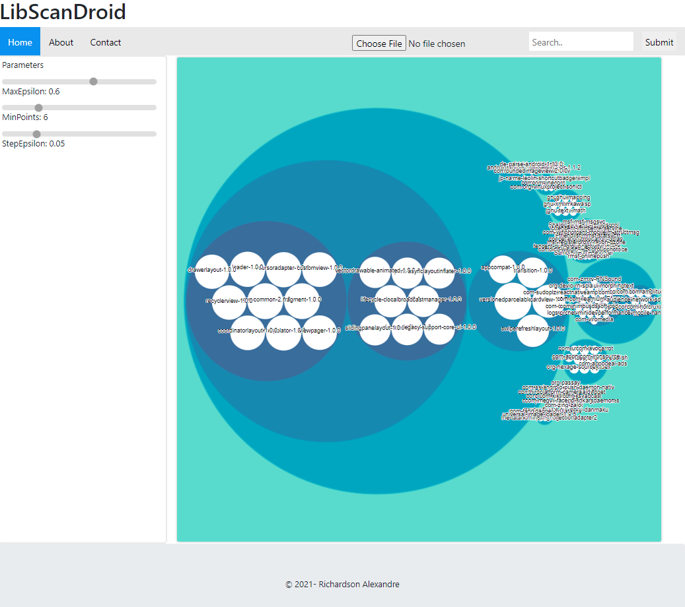

# LibScanDroid
VisulisationThe
 LibScanDroid website is available for viewing Library co-usage pattern
 This directory contains a file index.html which allows you to launch the site for viewing libraries. The data directory contains the Json files that feeding the visualisation. 
 # Preview
 We can preview LibScanDroid by using the following link [LibScanDroid](https://alexingfds.github.io/visualisation/index.html)
 

# Troubleshooting
If you encounter any difficulties in working with the tool or the datasets, please do not hesitate to contact us at githe following email:  richardson.alexandre.1@ens.etsmtl.ca. We will try our best to answer you as soon as possible.

# Visualisation
In the left panel we have the parameters that can be modified by using the slidebar. In the main we have the visualisation of library pattern. somme partterns could be missed depending on  the parameters because they had not been generated so they are not in data folder.
# Recommandation
In the menu bar there is in the right side a search bar for searching specific library  in order to visualize the co-usage history. we a have an input that accept a text file with a list of libraries for searching.

